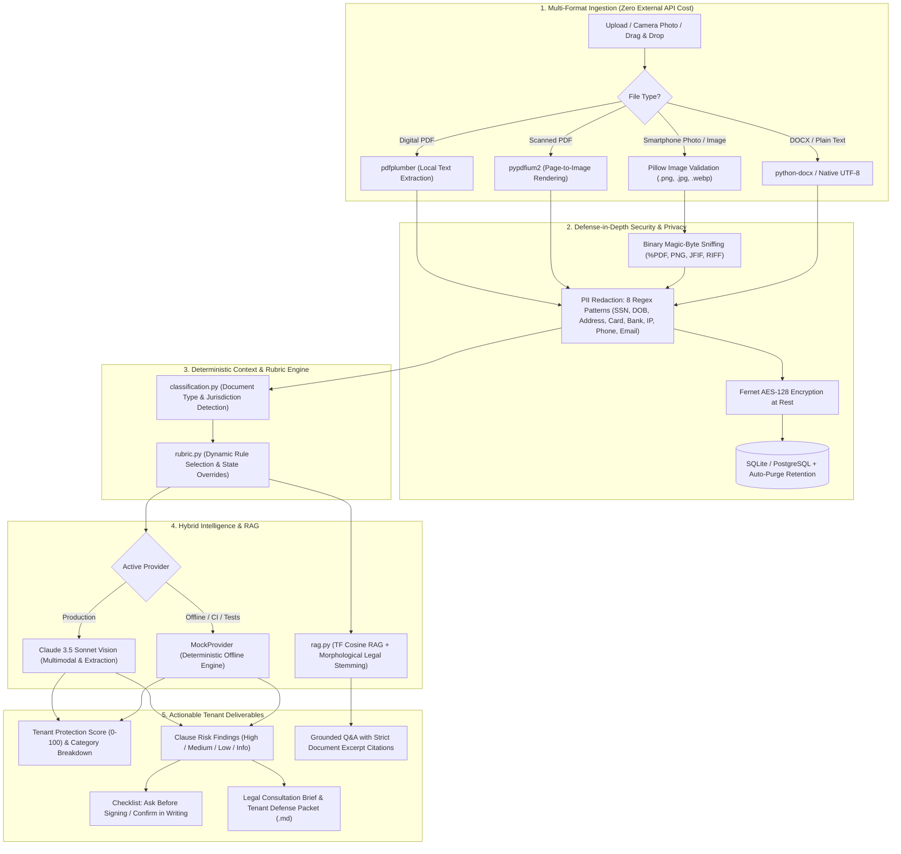

# 🔍 LeaseLens

<p align="center">
  
  
  
  
  
  
  
</p>

<h3 align="center">
  <strong>Context-aware, multimodal legal intelligence for tenants navigating leases, subleases, and eviction notices before they sign or vacate.</strong>
</h3>

<p align="center">
  <em>Built for the Legal GenAI Hackathon Challenge — <strong>Tenant Vertical</strong></em>
</p>

---

> [!IMPORTANT]
> **Information, Not Legal Advice**: LeaseLens empowers renters to understand complex contracts, compare terms, and spot predatory clauses. Every output clearly provides pointers to certified tenant rights clinics, housing advocates, and licensed attorneys. State-specific figures (deposit limits, notice windows) are illustrative examples parameterized in `app/rubric.py`.

---

## 🌟 Why LeaseLens?

Renters are consistently on the losing side of an asymmetric contract: landlords have attorneys who draft complex, multi-page leases filled with hidden penalties, vague maintenance duties, and rights waivers. When eviction or vacate notices arrive, tenants face panicked, high-stakes deadlines without knowing what questions to ask or whether the notice is legally compliant.

**LeaseLens is not a chatbot bolted onto a generic prompt.** 

It is powered by a deterministic **Context-Aware Rubric Engine**:
1. **Identifies Context First**: Detects what kind of document it is (*residential lease*, *sublease*, *roommate agreement*, *notice to vacate*, or *lease addendum*) and the **jurisdiction** (*CA, NY, TX, etc.*).
2. **Selects the Right Rubric**: A notice to vacate is checked against urgent response deadlines, with-cause requirements, and cure windows; a sublease is verified against landlord consent and master lease incorporation; a residential lease is checked for deposit caps and entry notice rules.
3. **Multimodal Ingestion**: Accepts digital PDFs, scanned PDFs, and **smartphone photos of paper notices taped to a door**.
4. **Calculates a Tenant Protection Score (0–100)**: Gives tenants an immediate, visual health check of contractual fairness.
5. **Exports a Legal Aid Consultation Brief**: Compiles a professional markdown intake packet that tenants can bring directly to a free legal aid clinic or attorney.

---

## 🏗️ System Architecture



---

## ⚡ Key Innovations & Features

### 1. The Context-Aware Rubric Engine
A static checklist fails because a residential lease and a notice to vacate have completely different legal priorities. LeaseLens deterministically selects the rubric *before* any LLM touches the clause text:
- **Notice to Vacate**: Checks for specific reasons (*for-cause* vs *no-cause*), legal response deadlines (*days to cure*), and vacancy timelines.
- **Sublease**: Verifies landlord written consent, master lease incorporation, and subtenant indemnification.
- **Residential Lease**: Verifies deposit return windows, landlord entry notice hours, and habitability obligations.
- **Jurisdiction-Specific Thresholds**: Applies state-law limits (e.g., California's 2-month deposit limit and 21-day return window; New York's 1-month deposit cap).

### 2. Multimodal Photo & PDF Ingestion (Zero Commercial Parser API Needed)
Tenants rarely have digital `.txt` contracts. LeaseLens accepts:
- **Digital PDFs**: Extracted in `<100ms` using local `pdfplumber`.
- **Scanned PDFs**: Automatically rendered to high-resolution page buffers via `pypdfium2`.
- **Smartphone Photos**: Accepts `.jpg`, `.png`, and `.webp` photos of physical notices and multi-page paper leases, transcribing them directly using Claude Vision.
- **Zero External Parser Cost**: No \$0.05/page fees for AWS Textract or LlamaParse; runs completely private and local.

### 3. Tenant Protection Score (0–100)
Outputs an algorithmic protection index weighted by severity:
- **High-Severity Protections** (Deposit terms, eviction reasons, landlord consent): `3x` weight.
- **Medium-Severity Protections** (Entry notice, maintenance responsibility, late fees): `2x` weight.
- **Flexibility & Rights** (Subletting, auto-renewal, legal right waivers): `1x` weight.
- Visual breakdown across 5 categories: **Financial**, **Maintenance**, **Access & Privacy**, **Termination & Deadlines**, and **Legal Rights**.

### 4. Legal Aid Consultation Packet & Brief Export
Tenants preparing to visit a tenant legal clinic, legal aid society, or private attorney can click **"Download Legal Aid Brief (.md)"** to produce a structured intake defense packet including:
- Document Type & Classification Confidence
- Calculated Tenant Protection Score & Category Breakdown
- Red Flag Warnings (*"Ask Before Signing"*)
- Ambiguities to Confirm in Writing
- Pre-formulated questions for housing counsel

### 5. Privacy-by-Design & Security Hardening
- **8-Category PII Redaction**: Masks SSNs, dates of birth, street addresses, credit cards, bank accounts, phone numbers, emails, and IP addresses before text is stored or sent to an LLM.
- **Fernet Encryption at Rest**: Encrypted in the database with AES-128.
- **Defensive HTTP Security Headers**: Injects `Content-Security-Policy`, `X-Content-Type-Options: nosniff`, `X-Frame-Options: DENY`, `Referrer-Policy`, and `Permissions-Policy`.
- **Pluggable Distributed Rate Limiting**: In-memory token bucket by default, with native Redis rate limiting via `LEASELENS_REDIS_URL`.
- **Data Auto-Purge**: Stored records automatically expire after 30 days and are purged on startup.

### 6. Full WCAG 2.1 Accessibility
- **Screen-Reader Live Regions**: `aria-live="polite"` dynamically announces analysis completion, protection scores, and clipboard actions.
- **Visual A11y Suite**: Built-in **A+ / A− font scaling**, **High contrast mode**, and **Plain-language toggle** (~8th-grade reading level).
- **Zero-Barrier In-Browser Mode**: Evaluators can open `frontend/index.html` directly in any web browser without running servers; embedded `pdf.js` parses PDFs locally.

---

## 🚀 Quickstart

### Option 1: Standalone Browser Mode (Zero Backend Required)
Evaluate the full UI, rubric engine, PII redaction, PDF extraction, and Q&A immediately:
1. Double click [`frontend/index.html`](file:///C:/Users/Manan%20Shah/Downloads/LeaseLens/leaselens/frontend/index.html) or open it in any browser.
2. Click **"Try a sample lease"**, **"Try a sample notice"**, or upload a PDF/photo.
3. Review findings, adjust text size, switch to high contrast, or download the consultation brief.

---

### Option 2: Python Local Setup (FastAPI Backend)

```powershell
# 1. Navigate to project
cd leaselens

# 2. Activate virtual environment
.\.venv\Scripts\Activate.ps1

# 3. Configure environment
cp .env.example .env
# Edit .env and set your secrets (or keep default mock provider for offline use)

# 4. Run API server
uvicorn app.main:app --reload --port 8000
```

- **Interactive API Documentation (Swagger)**: [http://localhost:8000/docs](http://localhost:8000/docs)
- **Health Check**: [http://localhost:8000/api/health](http://localhost:8000/api/health)

---

### Option 3: Docker Compose

```bash
docker compose up --build
# API Backend: http://localhost:8000
# Frontend:    http://localhost:8080
```

---

## 📡 API Reference

| Method | Endpoint | Description |
| :--- | :--- | :--- |
| `POST` | `/api/session` | Issue an anonymous, signed JWT session token |
| `POST` | `/api/documents` | Upload PDF, DOCX, TXT, or Image (`.png`, `.jpg`, `.webp`) with PII redaction |
| `GET` | `/api/documents/{id}` | Retrieve document metadata and redaction audit counts |
| `POST` | `/api/documents/{id}/analyze` | Run rubric extraction; returns Tenant Protection Score and clause findings |
| `GET` | `/api/documents/{id}/checklist` | Generate prioritized action checklist (*Ask before signing*, *Confirm in writing*) |
| `GET` | `/api/documents/{id}/export-brief`| Export formatted Markdown Legal Consultation Brief for clinics |
| `POST` | `/api/documents/{id}/ask` | Grounded Q&A against document chunks with citations |
| `POST` | `/api/documents/compare` | Cross-document rubric diff comparing two lease versions |
| `GET` | `/api/health` | Health check endpoint |

---

## 🧪 Testing & Code Quality

LeaseLens includes an exhaustive automated test suite with **100% pass rate** across all modules.

```powershell
.\.venv\Scripts\pytest -v
```

```text
============================= test session starts =============================
platform win32 -- Python 3.13.7, pytest-8.3.3, pluggy-1.6.0
collected 82 items

tests/test_anthropic_provider.py ......                                  [  7%]
tests/test_api_flow.py ..........                                        [ 19%]
tests/test_checklist.py ...                                              [ 23%]
tests/test_classification.py .......                                     [ 31%]
tests/test_compare.py ...                                                [ 35%]
tests/test_db_retention.py ...                                           [ 39%]
tests/test_enhanced_features.py .......                                  [ 47%]
tests/test_image_pdf_parsing.py ......                                   [ 54%]
tests/test_mock_provider.py ......                                       [ 62%]
tests/test_parsing.py .......                                            [ 70%]
tests/test_provider_factory.py ...                                       [ 74%]
tests/test_rag.py ....                                                   [ 79%]
tests/test_rubric.py .....                                               [ 85%]
tests/test_security.py ............                                      [100%]

======================= 82 passed in 1.47s =======================
```

Check code formatting and linter compliance:
```powershell
.\.venv\Scripts\ruff check .
# Output: All checks passed!
```

---

## 📁 Repository Structure

```
leaselens/
├── app/
│   ├── config.py              # Centralized environment settings (Pydantic BaseSettings)
│   ├── security.py            # Upload validation, 8-pattern PII redaction, Fernet encryption, rate limiting
│   ├── parsing.py             # PDF, DOCX, TXT, and Image (.png, .jpg) parsing pipeline
│   ├── classification.py      # Deterministic document type & US jurisdiction detection
│   ├── rubric.py              # Context-aware rubric rule selection & Tenant Protection Score calculation
│   ├── extraction.py          # Pipeline orchestrator (classify -> rubric -> score -> extract)
│   ├── rag.py                 # Grounded retrieval with morphological legal suffix stemming
│   ├── qa.py                  # Grounded question answering engine
│   ├── checklist.py           # Actionable checklist & Legal Consultation Brief generator
│   ├── compare.py             # Cross-document rubric alignment diff
│   ├── models.py              # SQLAlchemy ORM models & Pydantic request/response schemas
│   ├── db.py                  # Database engine, session management, and auto-purge task
│   ├── auth.py                # Anonymous signed session token authorization
│   ├── main.py                # FastAPI factory, security headers middleware, CORS, lifespan
│   ├── routers/               # Modular REST API endpoints
│   │   ├── session.py
│   │   ├── documents.py
│   │   ├── analysis.py
│   │   └── qa.py
│   └── llm/                   # Pluggable LLM provider abstraction
│       ├── provider.py        # Abstract LLMProvider interface (extract, answer, summarize, vision)
│       ├── mock_provider.py   # Offline deterministic mock engine for CI & tests
│       └── anthropic_provider.py # Claude 3.5 Sonnet multimodal vision & analysis implementation
├── frontend/
│   └── index.html             # Standalone, WCAG-compliant web UI with embedded pdf.js and score dial
├── tests/                     # 82 automated unit, integration, and security tests
│   ├── test_api_flow.py
│   ├── test_security.py
│   ├── test_enhanced_features.py
│   ├── test_image_pdf_parsing.py
│   ├── test_rubric.py
│   ├── test_rag.py
│   └── ...
├── Dockerfile                 # Hardened non-root container deployment
├── docker-compose.yml         # Multi-container orchestration (API + Nginx frontend)
├── requirements.txt           # Production dependencies
├── requirements-dev.txt       # Development & testing dependencies
└── README.md                  # Comprehensive documentation
```

---

## ⚖️ Legal Disclaimer

LeaseLens is designed to assist tenants and housing advocates by organizing and explaining contractual language from their documents. **It does not provide formal legal advice, legal representation, or attorney-client privilege.** Tenancy statutes, rent stabilization ordinances, and eviction procedures vary significantly by state, county, and municipality. Always consult a licensed attorney or certified local tenant advocacy clinic for formal legal counsel.
